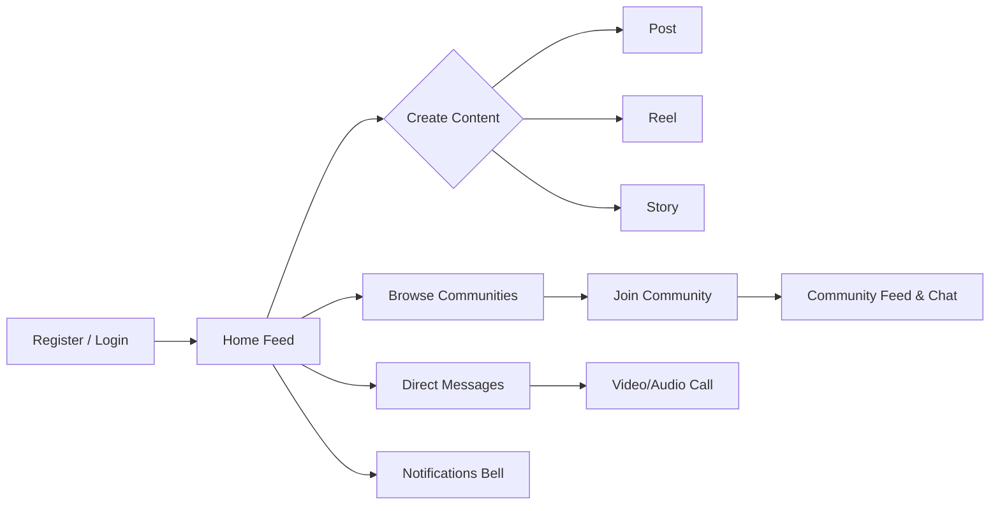
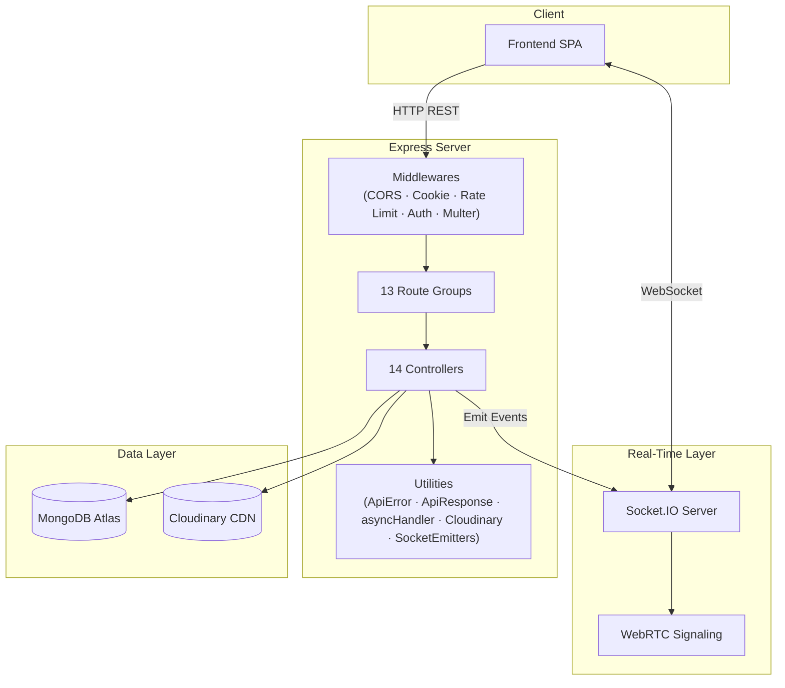
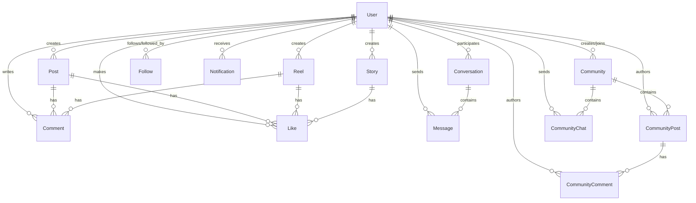
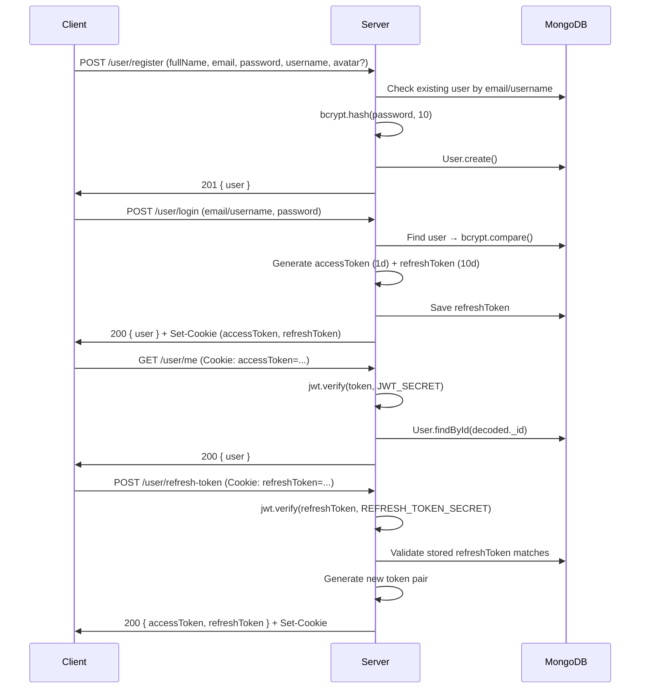

# Synapse Backend — Complete Documentation

### 1.1 What Is Synapse?

Synapse is a **full-stack social media platform** offering Instagram/Reddit-style content sharing, real-time messaging, community spaces, and video calling — all unified under a single REST + WebSocket API.

### 1.2 Core Feature Set

| Feature Area           | Capabilities                                                                                                            |
| ---------------------- | ----------------------------------------------------------------------------------------------------------------------- |
| **User Accounts**      | Register, login (JWT), logout, refresh tokens, change password, delete account, avatar upload, privacy settings         |
| **Posts**              | Create image/video posts, CRUD, search by caption, pagination, soft-delete                                              |
| **Reels**              | Short-form video upload/delete, reel feed (following-based), pagination                                                 |
| **Stories**            | Ephemeral media (24h TTL via MongoDB TTL index), story feed grouped by user                                             |
| **Social Graph**       | Follow/unfollow toggle, follower/following lists, recently active followed users                                        |
| **Engagement**         | Like/unlike posts, reels, stories; comment on posts & reels; delete comments                                            |
| **Home Feed**          | Aggregated posts from followed users + self, enriched with `isLiked` status                                             |
| **Communities**        | Create, join/leave, public/private, admin roles, rules, cover/avatar images                                             |
| **Community Posts**    | Create, like, delete within communities; joined-communities feed; public feed                                           |
| **Community Comments** | Add, list, delete comments on community posts                                                                           |
| **Community Chat**     | Persistent group messaging per community, real-time via Socket.IO                                                       |
| **Direct Messaging**   | 1:1 conversations, real-time message delivery, typing indicators                                                        |
| **Notifications**      | Persistent notifications for likes, comments, follows, posts, reels, stories, community activity; mark-read, delete-all |
| **Video/Audio Calls**  | WebRTC signaling (offer/answer/ICE) relayed through Socket.IO                                                           |
| **Real-Time Presence** | Online user tracking, user status broadcasts, recently active users                                                     |

### 1.3 User Flows (High-Level)



---

## 2. System Architecture

### 2.1 Architecture Diagram



### 2.2 Directory Structure

```
backend/
├── .env                          # Environment variables
├── package.json                  # Dependencies & scripts
├── render.yaml                   # Render deployment config
└── src/
    ├── index.js                  # Entry point: HTTP + Socket.IO server bootstrap
    ├── app.js                    # Express app config, CORS, routes, error handlers
    ├── swagger.js                # Swagger/OpenAPI configuration
    ├── db/index.js               # MongoDB connection with auto-retry
    ├── controllers/              # 14 business logic handlers
    ├── routes/                   # 13 Express route files (Swagger annotated)
    ├── models/                   # 14 Mongoose schemas
    ├── middlewares/               # Auth, Multer, Zod, Rate Limiter
    ├── utils/                    # ApiError, ApiResponse, asyncHandler, Cloudinary, etc.
    ├── socket/                   # Socket.IO init, call signaling, notification emitter
    └── public/temp/              # Temporary file upload staging
```

### 2.3 Request Lifecycle

```
Client Request
  → CORS middleware
  → cookie-parser
  → JSON/URL body parser (10MB limit)
  → Rate limiter (60 req/min on select routes)
  → Route matcher
    → verifyJWT middleware (if protected)
    → Multer middleware (if file upload)
    → Controller (business logic)
      → Mongoose model operations
      → Cloudinary upload (if media)
      → Socket.IO emit (if real-time event)
      → ApiResponse / ApiError
  → Global error handler
  → 404 catch-all
```

---

## 3. Data Models

### 3.1 Entity Relationship Diagram



### 3.2 Model Details

#### User — [user.model.js](<file:///home/x/coding/Orbit-V%20(copy)/backend/src/models/user.model.js>)

| Field               | Type    | Notes                                                              |
| ------------------- | ------- | ------------------------------------------------------------------ |
| `username`          | String  | **Required**, unique, trimmed                                      |
| `email`             | String  | **Required**, unique, lowercase                                    |
| `password`          | String  | **Required**, bcrypt-hashed (salt 10)                              |
| `fullName`          | String  | **Required**, trimmed                                              |
| `bio`               | String  | Max 160 chars                                                      |
| `avatar`            | String  | Cloudinary URL                                                     |
| `refreshToken`      | String  | Stored on login                                                    |
| `followersCount`    | Number  | Denormalized counter                                               |
| `followingCount`    | Number  | Denormalized counter                                               |
| `isVerified`        | Boolean | Verification status                                                |
| `VerificationBadge` | String  | Enum: `Gold`, `Silver`                                             |
| `privacy`           | Object  | `privateAccount`, `messagePolicy`, `allowMentions`, `allowTagging` |
| `lastActive`        | Date    | Updated on socket disconnect                                       |

**Instance Methods**: [isPasswordCorrect(password)](file:///home/x/coding/Orbit-V%20%28copy%29/backend/src/models/user.model.js#157-160), [generateAccessToken()](file:///home/x/coding/Orbit-V%20%28copy%29/backend/src/models/user.model.js#161-172) (1d), [generateRefreshToken()](file:///home/x/coding/Orbit-V%20%28copy%29/backend/src/models/user.model.js#173-185) (10d)

---

#### Post — [post.model.js](<file:///home/x/coding/Orbit-V%20(copy)/backend/src/models/post.model.js>)

| Field           | Type              | Notes                       |
| --------------- | ----------------- | --------------------------- |
| `user`          | ObjectId → User   | Indexed                     |
| `caption`       | String            | Max 2200                    |
| `mediaUrl`      | String            | **Required**                |
| `mediaType`     | String            | Enum: `image`, `video`      |
| `likes`         | [ObjectId → User] | Embedded array              |
| `likesCount`    | Number            | Denormalized                |
| `commentsCount` | Number            | Denormalized                |
| `viewsCount`    | Number            | —                           |
| `tags`          | [String]          | Lowercase, trimmed          |
| `visibility`    | String            | Enum: `public`, `followers` |
| `isDeleted`     | Boolean           | Soft delete flag            |

---

#### Reel — [reel.model.js](<file:///home/x/coding/Orbit-V%20(copy)/backend/src/models/reel.model.js>)

| Field                                         | Type            | Notes        |
| --------------------------------------------- | --------------- | ------------ |
| `user`                                        | ObjectId → User | Indexed      |
| `videoUrl`                                    | String          | **Required** |
| `caption`                                     | String          | —            |
| `likesCount` / `commentsCount` / `viewsCount` | Number          | Denormalized |
| `isDeleted`                                   | Boolean         | Soft delete  |

---

#### Story — [story.model.js](<file:///home/x/coding/Orbit-V%20(copy)/backend/src/models/story.model.js>)

| Field       | Type            | Notes                                       |
| ----------- | --------------- | ------------------------------------------- |
| `user`      | ObjectId → User | **Required**                                |
| `mediaUrl`  | String          | **Required**                                |
| `mediaType` | String          | Enum: `image`, `video`                      |
| `createdAt` | Date            | **TTL: 24 hours** — auto-deleted by MongoDB |
| `isDeleted` | Boolean         | Soft delete                                 |

---

#### Comment — [comment.model.js](<file:///home/x/coding/Orbit-V%20(copy)/backend/src/models/comment.model.js>)

| Field       | Type            | Notes                 |
| ----------- | --------------- | --------------------- |
| `post`      | ObjectId → Post | Nullable, indexed     |
| `reel`      | ObjectId → Reel | Nullable, indexed     |
| `user`      | ObjectId → User | **Required**          |
| `content`   | String          | **Required**, max 500 |
| `isDeleted` | Boolean         | Soft delete           |

> A Comment belongs to **either** a Post or a Reel (polymorphic).

---

#### Like — [like.model.js](<file:///home/x/coding/Orbit-V%20(copy)/backend/src/models/like.model.js>)

| Field   | Type             | Notes        |
| ------- | ---------------- | ------------ |
| `post`  | ObjectId → Post  | Nullable     |
| `reel`  | ObjectId → Reel  | Nullable     |
| `story` | ObjectId → Story | Nullable     |
| `user`  | ObjectId → User  | **Required** |

> Polymorphic: each Like targets exactly one of Post, Reel, or Story.

---

#### Follow — [follow.model.js](<file:///home/x/coding/Orbit-V%20(copy)/backend/src/models/follow.model.js>)

| Field       | Type            | Notes   |
| ----------- | --------------- | ------- |
| `follower`  | ObjectId → User | Indexed |
| `following` | ObjectId → User | Indexed |

**Compound unique index**: `{ follower: 1, following: 1 }`

---

#### Community — [community.model.js](<file:///home/x/coding/Orbit-V%20(copy)/backend/src/models/community.model.js>)

| Field                                                                                                | Type              | Notes                   |
| ---------------------------------------------------------------------------------------------------- | ----------------- | ----------------------- |
| [name](file:///home/x/coding/Orbit-V%20%28copy%29/backend/src/middlewares/multer.middleware.js#8-11) | String            | **Required**, unique    |
| `description`                                                                                        | String            | —                       |
| `coverImage` / `avatar`                                                                              | String            | Cloudinary URLs         |
| `creator`                                                                                            | ObjectId → User   | **Required**            |
| `admins`                                                                                             | [ObjectId → User] | —                       |
| `members`                                                                                            | [ObjectId → User] | —                       |
| `joinRequests`                                                                                       | [ObjectId → User] | For private communities |
| `isPrivate`                                                                                          | Boolean           | Default `false`         |
| `membersCount`                                                                                       | Number            | Denormalized            |
| `rules`                                                                                              | [String]          | —                       |

---

#### CommunityPost — [communityPost.model.js](<file:///home/x/coding/Orbit-V%20(copy)/backend/src/models/communityPost.model.js>)

| Field           | Type                 | Notes        |
| --------------- | -------------------- | ------------ |
| `community`     | ObjectId → Community | **Required** |
| `author`        | ObjectId → User      | **Required** |
| `text`          | String               | —            |
| `mediaUrl`      | String               | Cloudinary   |
| `likes`         | [ObjectId → User]    | Embedded     |
| `commentsCount` | Number               | Denormalized |

---

#### CommunityComment — [communityComment.model.js](<file:///home/x/coding/Orbit-V%20(copy)/backend/src/models/communityComment.model.js>)

`post` (→ CommunityPost), `author` (→ User), `text` — all required.

---

#### CommunityChat — [communityChat.model.js](<file:///home/x/coding/Orbit-V%20(copy)/backend/src/models/communityChat.model.js>)

`community` (indexed), `sender`, `content`, `isRead`. Compound index: `{ community: 1, createdAt: -1 }`.

---

#### Conversation — [conversation.model.js](<file:///home/x/coding/Orbit-V%20(copy)/backend/src/models/conversation.model.js>)

`participants` ([ObjectId → User]), `lastMessage` (String).

---

#### Message — [message.model.js](<file:///home/x/coding/Orbit-V%20(copy)/backend/src/models/message.model.js>)

`conversation` (indexed), `sender`, `receiver`, `content`, `isRead`.

---

#### Notification — [notification.model.js](<file:///home/x/coding/Orbit-V%20(copy)/backend/src/models/notification.model.js>)

| Field                                                     | Type            | Notes                                                                                                                                              |
| --------------------------------------------------------- | --------------- | -------------------------------------------------------------------------------------------------------------------------------------------------- |
| `user`                                                    | ObjectId → User | Recipient, indexed                                                                                                                                 |
| `fromUser`                                                | ObjectId → User | Trigger                                                                                                                                            |
| `type`                                                    | String          | Enum: `like`, `comment`, `follow`, `message`, `post`, `reel`, `story`, `community_like`, `community_comment`, `community_post`, `community_create` |
| `post` / `reel` / `story` / `communityPost` / `community` | ObjectId        | Contextual reference                                                                                                                               |
| `message`                                                 | String          | Custom text                                                                                                                                        |
| `isRead`                                                  | Boolean         | —                                                                                                                                                  |

---

## 4. API Reference

> **Auth**: Most endpoints require JWT via `Authorization: Bearer <token>` header or `accessToken` cookie.  
> **Pagination**: List endpoints accept `?page=1&limit=10` and return `{ page, totalPages, hasNext, hasPrev }`.  
> **Response Shape**: All responses follow `{ statusCode, data, message, success }` via [ApiResponse](file:///home/x/coding/Orbit-V%20%28copy%29/backend/src/utils/ApiResponse.js#1-9).

### 4.1 Authentication & User (`/api/v1/user`)

| Method  | Endpoint             | Auth            | Description                                           |
| ------- | -------------------- | --------------- | ----------------------------------------------------- |
| `POST`  | `/register`          | ❌ + Rate Limit | Register a new user (multipart: `avatar` optional)    |
| `POST`  | `/login`             | ❌ + Rate Limit | Login with email/username + password; sets cookies    |
| `POST`  | `/logout`            | ✅              | Clear tokens and cookies                              |
| `POST`  | `/delete`            | ✅              | Permanently delete account                            |
| `POST`  | `/refresh-token`     | ❌              | Rotate access + refresh tokens                        |
| `POST`  | `/change-password`   | ✅              | Change password (requires `oldPassword`)              |
| `GET`   | `/me`                | ✅              | Get current user details                              |
| `PUT`   | `/update-details`    | ✅              | Update `fullName`, `bio`, `email`, `username`         |
| `PATCH` | `/update-avatar`     | ✅              | Upload new avatar (multipart: `avatar`)               |
| `GET`   | `/u/:username`       | ✅              | Get user profile by username (includes `isFollowing`) |
| `GET`   | `/search?query=`     | ❌              | Search users by username or fullName                  |
| `GET`   | `/privacy`           | ✅              | Get privacy settings                                  |
| `PATCH` | `/privacy`           | ✅              | Update privacy settings                               |
| `GET`   | `/recently-active`   | ✅              | Get 10 recently active followed users                 |
| `POST`  | `/:userId/follow`    | ✅              | Toggle follow/unfollow                                |
| `GET`   | `/:userId/followers` | ❌              | List followers (paginated)                            |
| `GET`   | `/:userId/following` | ❌              | List following (paginated)                            |

---

### 4.2 Posts (`/api/v1/post`)

| Method   | Endpoint           | Auth | Description                                                                            |
| -------- | ------------------ | ---- | -------------------------------------------------------------------------------------- |
| `POST`   | `/create`          | ✅   | Create post (multipart: `media` required, `caption` optional). Notifies all followers. |
| `GET`    | `/user/:userId`    | ❌   | Get user's posts (paginated)                                                           |
| `GET`    | `/search?query=`   | ✅   | Search posts by caption                                                                |
| `GET`    | `/:postId`         | ❌   | Get single post                                                                        |
| `DELETE` | `/:postId`         | ✅   | Soft-delete post (owner only). Destroys Cloudinary asset.                              |
| `PATCH`  | `/:postId/caption` | ✅   | Update caption (owner only)                                                            |

---

### 4.3 Feed (`/api/v1/feed`)

| Method | Endpoint | Auth | Description                                                             |
| ------ | -------- | ---- | ----------------------------------------------------------------------- |
| `GET`  | `/`      | ✅   | Home feed: posts from followed users + self (paginated, with `isLiked`) |

---

### 4.4 Likes (`/api/v1/like`)

| Method | Endpoint          | Auth | Description                              |
| ------ | ----------------- | ---- | ---------------------------------------- |
| `POST` | `/post/:postId`   | ✅   | Toggle like on post (+ notification)     |
| `GET`  | `/post/:postId`   | ✅   | Get users who liked a post (paginated)   |
| `POST` | `/reel/:reelId`   | ✅   | Toggle like on reel                      |
| `GET`  | `/reel/:reelId`   | ✅   | Get users who liked a reel               |
| `POST` | `/story/:storyId` | ✅   | Toggle like on story                     |
| `GET`  | `/story/:storyId` | ✅   | Get users who liked a story (owner only) |

---

### 4.5 Comments (`/api/v1/comment`)

| Method   | Endpoint        | Auth | Description                                |
| -------- | --------------- | ---- | ------------------------------------------ |
| `POST`   | `/post/:postId` | ✅   | Add comment to post (+ notification)       |
| `GET`    | `/post/:postId` | ❌   | Get post comments (paginated)              |
| `POST`   | `/reel/:reelId` | ✅   | Add comment to reel                        |
| `GET`    | `/reel/:reelId` | ❌   | Get reel comments (paginated)              |
| `DELETE` | `/:commentId`   | ✅   | Delete comment (author or post/reel owner) |

---

### 4.6 Reels (`/api/v1/reel`)

| Method   | Endpoint        | Auth | Description                                                 |
| -------- | --------------- | ---- | ----------------------------------------------------------- |
| `POST`   | `/create`       | ✅   | Upload reel video (multipart: `media`). Notifies followers. |
| `GET`    | `/user/:userId` | ❌   | Get user's reels (paginated)                                |
| `GET`    | `/feed`         | ✅   | Reel feed from followed users (paginated)                   |
| `DELETE` | `/:reelId`      | ✅   | Soft-delete reel (owner). Destroys Cloudinary video.        |

---

### 4.7 Stories (`/api/v1/story`)

| Method   | Endpoint        | Auth | Description                                                                        |
| -------- | --------------- | ---- | ---------------------------------------------------------------------------------- |
| `POST`   | `/create`       | ✅   | Create story (multipart: `media`). Notifies followers. **Auto-deletes after 24h.** |
| `GET`    | `/user/:userId` | ❌   | Get user's stories (paginated)                                                     |
| `GET`    | `/feed`         | ✅   | Story feed: grouped by followed users, uses aggregation pipeline                   |
| `DELETE` | `/:storyId`     | ✅   | Soft-delete story (owner only)                                                     |

---

### 4.8 Communities (`/api/v1/community`)

| Method   | Endpoint               | Auth | Description                                                               |
| -------- | ---------------------- | ---- | ------------------------------------------------------------------------- |
| `GET`    | `/`                    | ✅   | List all communities (sorted by members, paginated)                       |
| `POST`   | `/`                    | ✅   | Create community (multipart: `avatar`, `coverImage`). Notifies followers. |
| `GET`    | `/joined`              | ✅   | Current user's joined communities (with `userRole`)                       |
| `GET`    | `/user/:userId/joined` | ✅   | Get communities a specific user joined                                    |
| `GET`    | `/created`             | ✅   | Current user's created communities                                        |
| `GET`    | `/search?query=`       | ✅   | Search communities by name                                                |
| `GET`    | `/:id`                 | ✅   | Get community details (fully populated)                                   |
| `PATCH`  | `/:id`                 | ✅   | Update community (admin/creator only)                                     |
| `DELETE` | `/:id`                 | ✅   | Delete community + cascade posts/comments (creator only)                  |
| `POST`   | `/:id/join`            | ✅   | Join community (or send request if private)                               |
| `POST`   | `/:id/leave`           | ✅   | Leave community                                                           |
| `POST`   | `/:id/approve`         | ✅   | Approve join request (admin only)                                         |
| `POST`   | `/:id/make-admin`      | ✅   | Promote member to admin (creator only)                                    |
| `POST`   | `/:id/remove-admin`    | ✅   | Demote admin (creator only)                                               |
| `POST`   | `/:id/remove-user`     | ✅   | Remove a member (admin/creator only)                                      |

---

### 4.9 Community Posts (`/api/v1/community-post`)

| Method   | Endpoint               | Auth | Description                                                                       |
| -------- | ---------------------- | ---- | --------------------------------------------------------------------------------- |
| `POST`   | `/:communityId`        | ✅   | Create community post (multipart: `media`). Notifies members + increments events. |
| `GET`    | `/:communityId`        | ✅   | Community-specific feed (members only, paginated)                                 |
| `GET`    | `/feed/joined`         | ✅   | Aggregated feed from all joined communities (paginated)                           |
| `GET`    | `/public/:communityId` | ❌   | Public community posts (public communities only)                                  |
| `POST`   | `/like/:postId`        | ✅   | Toggle like on community post                                                     |
| `DELETE` | `/:postId`             | ✅   | Delete community post (author/admin/creator)                                      |

---

### 4.10 Community Comments (`/api/v1/community-comments`)

| Method   | Endpoint      | Auth | Description                                  |
| -------- | ------------- | ---- | -------------------------------------------- |
| `POST`   | `/:postId`    | ✅   | Add comment (+ notification + event counter) |
| `GET`    | `/:postId`    | ✅   | Get comments for a community post            |
| `DELETE` | `/:commentId` | ✅   | Delete comment (author/post-author/admin)    |

---

### 4.11 Community Chat (`/api/v1/community-chat`)

| Method | Endpoint        | Auth | Description                                                               |
| ------ | --------------- | ---- | ------------------------------------------------------------------------- |
| `POST` | `/:communityId` | ✅   | Send message (members only). Emits `community:message:new` via Socket.IO. |
| `GET`  | `/:communityId` | ✅   | Get messages (paginated, newest-first fetch but reversed for display)     |

---

### 4.12 Direct Messages (`/api/v1/message`)

| Method | Endpoint           | Auth | Description                                                             |
| ------ | ------------------ | ---- | ----------------------------------------------------------------------- |
| `POST` | `/send`            | ✅   | Send DM (auto-creates conversation). Emits `message:new` via Socket.IO. |
| `GET`  | `/conversations`   | ✅   | List user's conversations                                               |
| `GET`  | `/:conversationId` | ✅   | Get messages in a conversation (sorted ascending)                       |

---

### 4.13 Notifications (`/api/v1/notification`)

| Method   | Endpoint | Auth | Description                                                       |
| -------- | -------- | ---- | ----------------------------------------------------------------- |
| `GET`    | `/`      | ✅   | Get user's notifications (latest 50, excludes self-notifications) |
| `PATCH`  | `/read`  | ✅   | Mark all notifications as read                                    |
| `DELETE` | `/`      | ✅   | Delete all notifications                                          |

---

## 5. Socket.IO Real-Time Events

### 5.1 Connection

Clients connect with query params: `?userId=<id>&username=<name>&avatar=<url>`. On connect, the server auto-joins the socket to all community rooms.

### 5.2 Event Catalog

#### Presence & Status

| Event          | Direction        | Payload                                | Description               |
| -------------- | ---------------- | -------------------------------------- | ------------------------- |
| `user:online`  | Client → Server  | `{ userId, username, avatar }`         | Register user as online   |
| `user:status`  | Server → Clients | `{ userId, status, username, avatar }` | Broadcast online/offline  |
| `online:users` | Server → Client  | `[{ userId, username, avatar }]`       | Initial online users list |

#### Direct Messaging

| Event         | Direction       | Payload                                    |
| ------------- | --------------- | ------------------------------------------ |
| `message:new` | Server → Client | Populated `Message` object                 |
| `typing`      | Bidirectional   | `{ conversationId, isTyping, receiverId }` |

#### Notifications

| Event              | Direction       | Payload                                                                                                                    |
| ------------------ | --------------- | -------------------------------------------------------------------------------------------------------------------------- |
| `notification:new` | Server → Client | Populated [Notification](file:///home/x/coding/Orbit-V%20%28copy%29/backend/src/socket/notification.socket.js#1-11) object |

#### Community

| Event                       | Direction          | Payload                                          |
| --------------------------- | ------------------ | ------------------------------------------------ |
| `community:join`            | Client → Server    | `{ communityId }`                                |
| `community:leave`           | Client → Server    | `{ communityId }`                                |
| `community:member:joined`   | Server → Room      | `{ user, community, membersCount, activity }`    |
| `community:post:new`        | Server → Room      | `{ post, activity }`                             |
| `community:post:liked`      | Server → Room      | `{ postId, likesCount, isLiked, activity }`      |
| `community:comment:new`     | Server → Room      | `{ comment, activity }`                          |
| `community:message:new`     | Server → Room      | `{ _id, sender, content, community, createdAt }` |
| `community:activeCount`     | Server → All       | `{ communityId, activeCount }`                   |
| `community:eventsCount`     | Server → All       | `{ communityId, eventsCount }`                   |
| `community:getActiveCounts` | Client → Server    | `{ communityIds: [] }`                           |
| `community:activeCounts`    | Server → Client    | `{ [communityId]: count }`                       |
| `community:eventsCounts`    | Server → Client    | `{ [communityId]: count }`                       |
| `friend:joined:community`   | Server → Followers | `{ user, community, activity }`                  |
| `friend:created:community`  | Server → Followers | `{ user, community, activity }`                  |

#### WebRTC Calls

| Event                           | Direction       | Payload                               |
| ------------------------------- | --------------- | ------------------------------------- |
| `call:start`                    | Client → Server | `{ to, offer, type }`                 |
| `call:incoming`                 | Server → Client | `{ from, fromSocketId, offer, type }` |
| `call:answer`                   | Bidirectional   | `{ to/from, answer }`                 |
| `call:ice`                      | Bidirectional   | `{ to/from, candidate }`              |
| `call:end`                      | Bidirectional   | `{ to/from }`                         |
| `call:reject` / `call:rejected` | Bidirectional   | `{ to/from }`                         |

---

## 6. Middleware Pipeline

| Middleware           | File                                                                                                          | Purpose                                                                      |
| -------------------- | ------------------------------------------------------------------------------------------------------------- | ---------------------------------------------------------------------------- |
| **CORS**             | [app.js](<file:///home/x/coding/Orbit-V%20(copy)/backend/src/app.js>)                                         | Dynamic origin, credentials, cross-origin cookies                            |
| **cookie-parser**    | [app.js](file:///home/x/coding/Orbit-V%20%28copy%29/backend/src/app.js)                                       | Parse cookies for JWT extraction                                             |
| **Body Parsers**     | [app.js](file:///home/x/coding/Orbit-V%20%28copy%29/backend/src/app.js)                                       | JSON + URL-encoded (10MB limit)                                              |
| **Rate Limiter**     | [rateLimiter.js](<file:///home/x/coding/Orbit-V%20(copy)/backend/src/middlewares/rateLimiter.js>)             | 60 req/min per IP (applied to register & login)                              |
| **Auth (verifyJWT)** | [auth.middleware.js](<file:///home/x/coding/Orbit-V%20(copy)/backend/src/middlewares/auth.middleware.js>)     | Extracts JWT from cookie or `Authorization` header; attaches `req.user`      |
| **Multer**           | [multer.middleware.js](<file:///home/x/coding/Orbit-V%20(copy)/backend/src/middlewares/multer.middleware.js>) | File upload: images & videos only, 50MB limit, saved to `./src/public/temp/` |
| **Zod Validation**   | [ZodValidator.js](<file:///home/x/coding/Orbit-V%20(copy)/backend/src/middlewares/ZodValidator.js>)           | Schemas for register/login _(currently commented out in controller)_         |

---

## 7. Utility Layer

| Utility             | File                                                                                              | Purpose                                                                   |
| ------------------- | ------------------------------------------------------------------------------------------------- | ------------------------------------------------------------------------- |
| **ApiError**        | [ApiError.js](<file:///home/x/coding/Orbit-V%20(copy)/backend/src/utils/ApiError.js>)             | Custom error class: `statusCode`, `message`, `errors[]`, stack trace      |
| **ApiResponse**     | [ApiResponse.js](<file:///home/x/coding/Orbit-V%20(copy)/backend/src/utils/ApiResponse.js>)       | Standardized `{ statusCode, data, message, success }` wrapper             |
| **asyncHandler**    | [asyncHandler.js](<file:///home/x/coding/Orbit-V%20(copy)/backend/src/utils/asyncHandler.js>)     | HOF wrapping async controllers to forward errors to Express error handler |
| **Cloudinary**      | [cloudinary.js](<file:///home/x/coding/Orbit-V%20(copy)/backend/src/utils/cloudinary.js>)         | Upload to Cloudinary → delete local temp file → return response           |
| **Socket Emitters** | [socketEmitters.js](<file:///home/x/coding/Orbit-V%20(copy)/backend/src/utils/socketEmitters.js>) | `emitToUser`, `emitToCommunity`, `emitToFollowers`, `emitCommunityEvent`  |
| **noEmoji**         | [noEmoji.js](<file:///home/x/coding/Orbit-V%20(copy)/backend/src/utils/noEmoji.js>)               | Regex-based emoji detection _(not actively used)_                         |

---

## 8. Authentication Flow


